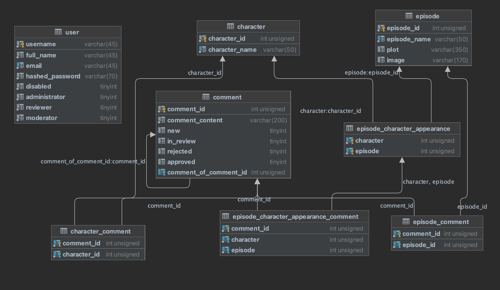

# JellyRick

API to post comments about Rick & Morty universe

## Dev quick start 🚀

Prerequisites:

- Linux, Mac or WSL environment
- git installed (https://git-scm.com/book/en/v2/Getting-Started-Installing-Git)
- docker and docker-compose installed (https://docs.docker.com/compose/install/)
- python3, python3-pip installed (https://pip.pypa.io/en/stable/installation/)

```bash
git clone git@github.com:benjmathias/jellyrick.git
cd jellyrick/devops

# Optional command : parallel build for faster builds
docker-compose -f dev.docker-compose.yml build --parallel jellyrick db

docker-compose -f dev.docker-compose.yml up -d
```

Access logs with : 
```bash
docker-compose -f dev.docker-compose.yml logs -f
```

Access the interactive openapi docs with :

- http://localhost/docs

See the json openapi schema here :
- [openapi.json](./docs/openapi.json)

**Live reload functionality**.  
Change the python source code and see the front reload live, enjoy !

## Database usage 📚



Follow the "dev quick start" step above first !

- Get **episode and character** data from api with a python script ([script](db/script/ep_char_write_from_web_to_json.py)) :

```bash
pip3 install requests
# cd to this project root
cd db/script
chmod +x ep_char_write_from_web_to_json.py
# ./ep_char_write_from_web_to_json.py <OUTPUT_PATH>
./ep_char_write_from_web_to_json.py "../data_source"
```

- Get **metadata** about Rick and Morty from api with a python script ([script](db/script/metadata_write_from_web_to_json.py)) :

```bash
pip3 install requests
# cd to this project root
cd db/script
chmod +x metadata_write_from_web_to_json.py
# Create an account to get api key from imdb here (not official imdb api) : https://imdb-api.com/api
export API_KEY_IMDB=<YOUR_API_KEY>
# /metadata_write_from_web_to_json.py <OUTPUT_PATH> <SEASON_TOTAL_NUMBER> <API_KEY_IMDB>
./metadata_write_from_web_to_json.py "../data_source" 5 "${API_KEY_IMDB}"
```

- Script usage to insert data from json file to DB ([script](db/script/ep_char_insert_from_json_to_db.py)) :

```bash
pip3 install mysql-connector-python
# cd to this project root
cd db/script
chmod +x ep_char_insert_from_json_to_db.py
./ep_char_insert_from_json_to_db.py "universe" "root" "root" "127.0.0.1" "../data_source"
```

You can check with adminer front that the data has been inserted, connect with "universe" database and "root" "root"
credentials :

- http://localhost:8080/?server=db&username=root&db=universe&select=character

To connect with mysql-client cli to DB from host :

```bash
mysql -u root -p'root' -h 127.0.0.1 -D universe
```

To connect with mysql-client cli to DB from inside the API container :

```bash
docker exec -it jellyrick-api bash
apk add --update mysql-client mariadb-connector-c
mysql -u rick -p'morty' -h db -D universe
```

## Tests 🔎

### Unit test

To run the unit tests of this project and show coverage, run these commands :

```bash
pip3 install pytest pytest-cov
# cd to this project root
pytest --cov=api/app api/tests/
```

## Tasks 🖊️

- [x]  Init base files (15 minutes)
    - [x]  Create project on github
    - [x]  Add readme
    - [x]  Add .gitignore
    - [x]  Add CHANGELOG
- [x]  Feature 1
    - [x]  DB dev environment
        - [x]  Dockerfile
        - [x]  docker-compose
    - [x]  Init the db structure, dump it, put the dump in db container entrypoint
    - [x]  Retrieve characters and episodes data from the web (rickandmortyapi.com) and write it to
      JSON : ([script](db/script/ep_char_write_from_web_to_json.py), [data_example](./db/data_source/rick_data_episode.json))
    - [x]  Python import script ([script](db/script/ep_char_insert_from_json_to_db.py))
    - [x]  Fastapi base structure
    - [x]  api dev environment
        - [x]  Dockerfile
        - [x]  docker-compose
    - [x]  Add db insertion script at the beginning of the dev entrypoint of the API
    - [x]  Write the two routes (retrieve data from mysql)
    - [x]  Write unit test for the two routes
    - [ ]  BONUS : more unit tests (fail case test and others)
    - [ ]  BONUS : Write functional test (fastapi.testclient)
- [x]  Feature 2
    - [x]  DB structure for comment table
    - [x]  Populate data for new table
    - [x]  Write CRUD routes for comments
- [x]  Feature 3
    - [x]  Pagination system
    - [x]  Add filters
- [x]  Feature 4
    - [x]  Implement JWT and OAuth2 in fastapi with users variable as faked db
    - [x]  Create dev.env.tpl and use it with docker-compose
    - [x]  Add USER table in MYSQL
    - [x]  Link JWT with DB
- [x]  Feature 5
    - [x]  Add report route for CSV file download
    - [x]  Add report route for XLS file download
- [x]  Backlog
    - [x]  Add report route for CSV file download
